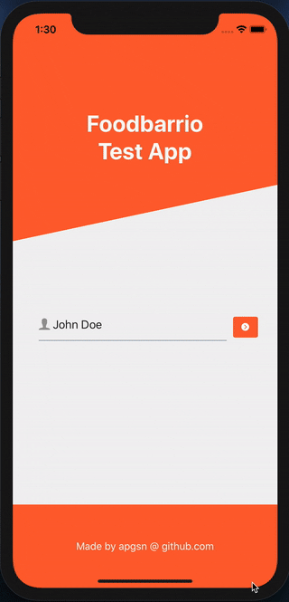

# Foodbarrio ReactNative & GraphQL test
For reference, see original readMe below.



## App setup
Tools you have to install in advance on your machine to run this app: PostgreSQL, an iOS or Android emulator, Node.js, npm, and the expo CLI.

### Steps to install
1) Open your favorite Postgres client and create a new database with a name of your choosing (eg. `foodbarrio_challenge_db`)  
1) Create a file named `.env` in the project root folder and complete it with your Postgres credentials, eg.:
```
PGDATABASE=foodbarrio_challenge_db
PGHOST=localhost
PGPORT=5432
PGUSER=postgres
PGPASSWORD=<your_pg_pwd>
```
3) in project root folder, `npm install` to install server node modules, then launch `npm run db-setup` to build the database and fill it in with some test data (*knex seeds*)  
4) `cd client && npm install` to install client node modules

### Steps to launch
Once the installation is complete, in project root folder run `npm start` to run the server (on default port 4000), then `cd client && expo start` to start the expo CLI. From there you can choose whichever device you prefer to run the app.  

Note that if you're running the app on a different machine (such as a physical device) you won't be able to connect to the local database, in this case I suggest using a service like [ngrok](https://ngrok.com/) to create a safe public tunnel to your localhost and then set the Apollo client URI in `App.js`.

<br />

-----

The goal is to implement a small Post/Comments app using GraphQL API and React Native.

## Screens
The app will have three screens.
 - [x] **Login**  
 - [x] **List of posts**  
 - [x] **Create/Edit post**  
 - [x] **Post details**

### Navigation
 - The user inserts his/her username in the "Login" screen to enter the app. If the inserted username doesn't exists, it will be created.
 - After the login the user is moved to the "List of posts" screen where he/she can scroll the list of available posts (each post indicating when it has been created, the number of comments and the number of likes received).
 - From the "List of posts" screen the user can navigate back to the "Login" screen (logout) or to the "Post details" screen by tapping on one post.
 - In the "Post details" screen the user can scroll the list of available comments (each comment indicating when it has been created and the number of likes received).
 - From the "Post details" screen the user can navigate back to the "Login" screen (logout) or to the "List of posts" screen.

## Use cases
### Must have
As a user I can
 - [x] enter the app with a username
 - [x] see all available posts
 - [x] create new posts
 - [x] edit/delete my posts
 - [x] like and unlike my or other posts
 - [x] create new comments on my or other posts
 - [x] edit/delete my comments on posts
 - [x] like and unlike my or other comments

As a user I can't
 - [x] delete or edit posts of other users
 - [x] delete or edit comments of other users
 
### Desiderable
As a user I can
 - [ ] see new posts from other users without refreshing the "List of posts" screen
 - [ ] see new comments from other users without refreshing the "Post Details" screen
 - [ ] see new likes from other users without refresing the "Post Details" 

### Nive to have
As a user I can
 - [ ] search content in the posts

## Data structure
This is only an example of a possible data structure that can be used
### User
 - [x] username
 
### Posts
 - [x] username of the author
 - [x] title
 - [x] content
 - [x] createdAt

### Comments
 - [x] parentPost
 - [x] username of the author
 - [x] title
 - [x] content
 - [x] createdAt
 
### Likes
 - [x] parentPost or parentComment
 - [x] username of the author
 - [x] createdAt

## Tools that you have to use
### Must have
 - [x] NodeJS and NPM
 - [x] Apollo Server (GraphQL) 
 - [x] Apollo Client
 - [x] React Navigation

### Desiderable
 - [ ] Express
 - [x] Knex (with migrations)
 - [x] PostgreSQL

### Nice to have
 - [x] Expo
 
## Documentation
All steps to install, maintain and run the app must be documented 

## NOTE
The submission will be **DISCARDED** if it **DOES NOT** provide instructions on how to install and configure the test environment (server, app, database,...).

## Submission

Fork this repository and send us a pull request.
